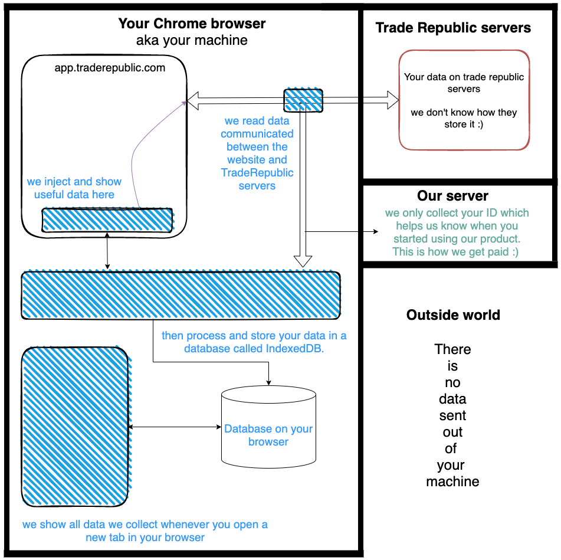
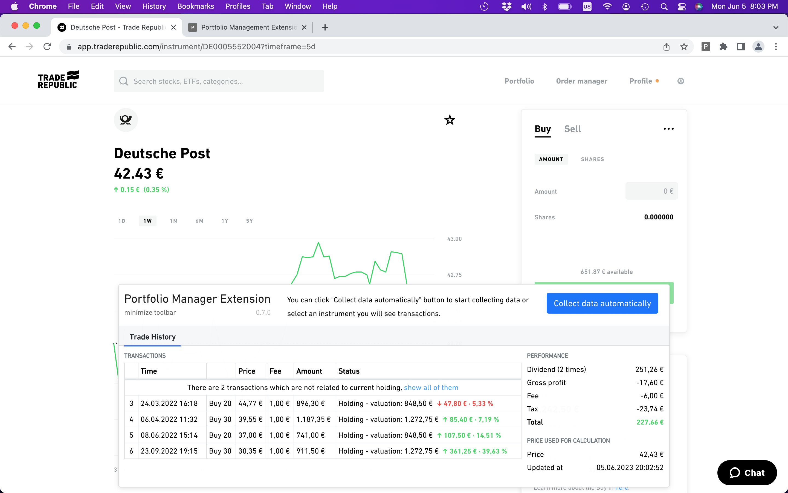
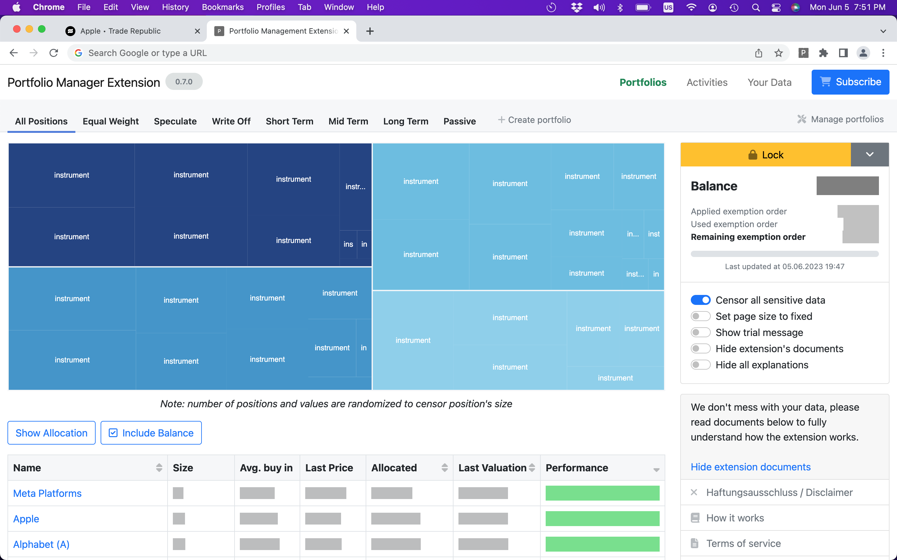
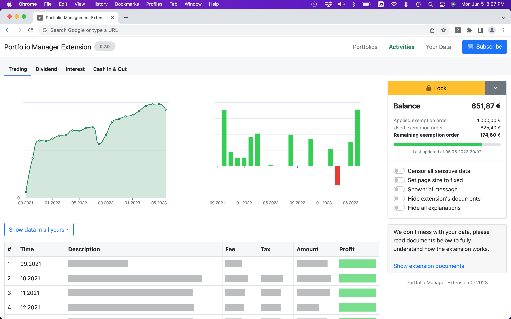
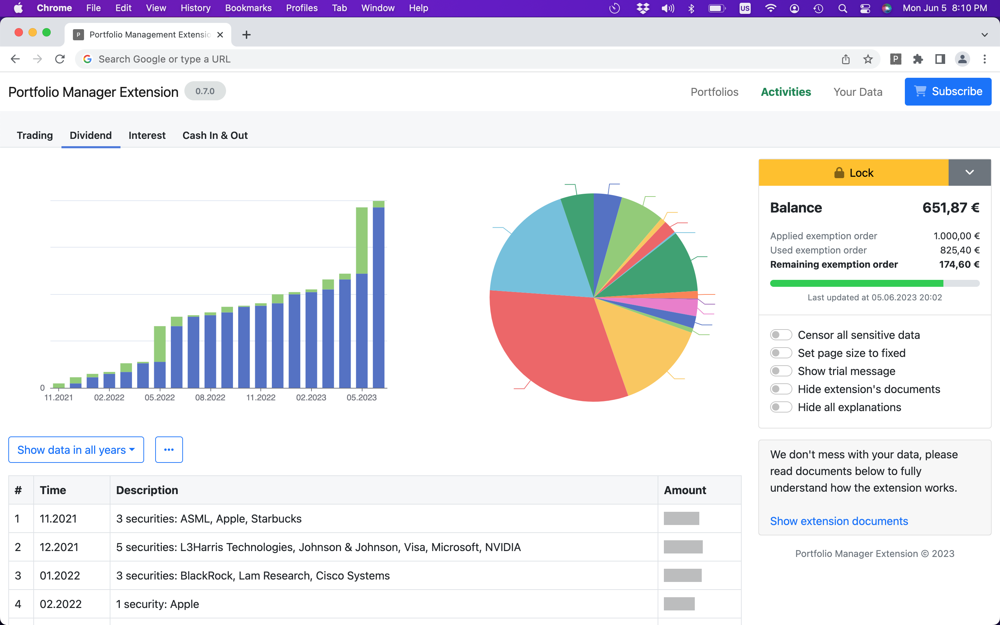
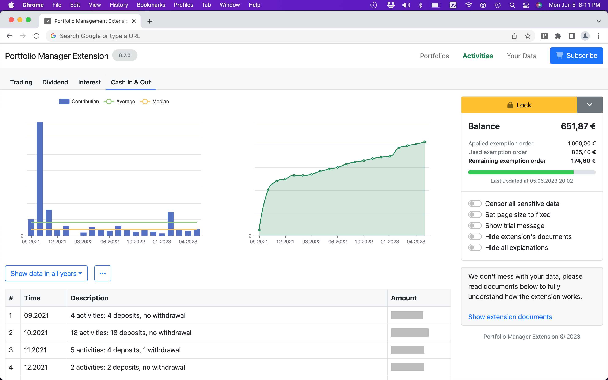
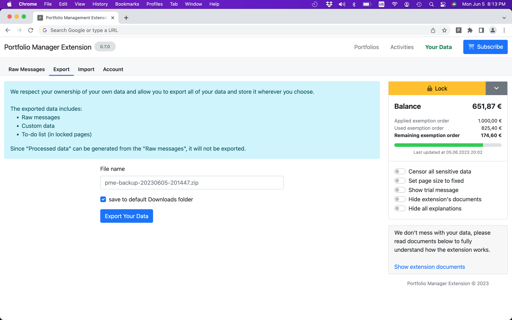
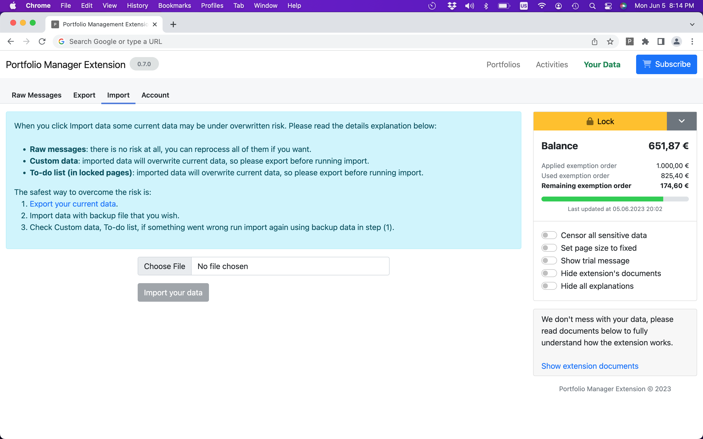
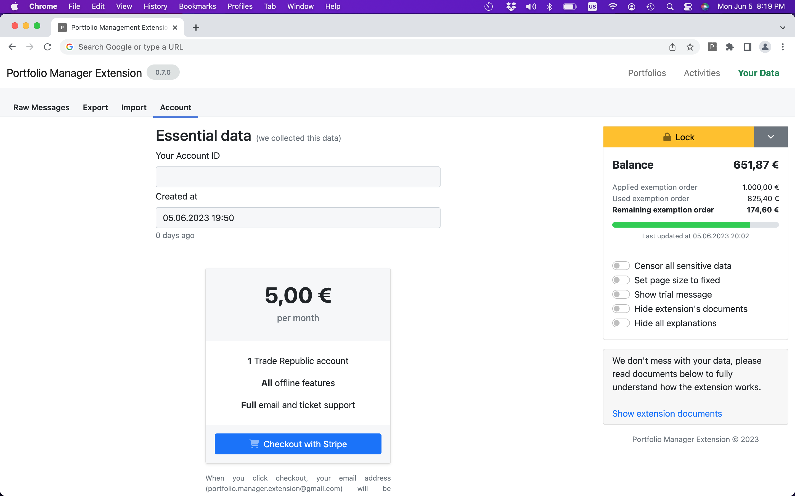

# [Portfolio Manager Extension](https://chrome.google.com/webstore/detail/piiaagkdgpmnhmeggidclfiicicdknea) for Trade Republic

The [Portfolio Manager Extension](https://chrome.google.com/webstore/detail/piiaagkdgpmnhmeggidclfiicicdknea) is a
Chrome extension designed to enhance your trading activities by importing data from
Trade Republic and providing valuable insights.

It's important to note that the extension functions solely as a reader and display tool. It does not facilitate any
trading activities. Rest assured that all your data is securely stored on your own machine and never transmitted to any
external sources. Your privacy and data security are our top priorities.

## How it works

_The diagram illustrates the architecture of the extension, with all extension components depicted in blue. These
components include the Banner, Reader, and App, which interact with the Trade Republic website and server to enable
seamless data collection and visualization for portfolio management._

The extension consists of three main components:

1. Banner: A small banner at the bottom of the Trade Republic app website that displays instructions and useful
   information. The Banner component does not store any credentials, and you need to log in to the Trade Republic
   website
   manually.
2. Reader: A hidden code that listens to your interactions with Trade Republic. It captures the data you communicate
   with
   Trade Republic but does not store any credentials or personal data. The Reader component also requires you to log in
   to
   the Trade Republic website independently.
3. App: The application that presents the data collected by the Reader. You can access the app whenever you open a new
   tab.
   Both the Banner and Reader components operate when you open and log in to your Trade Republic account. No data is
   stored
   during this process, and it is essential to note that they do not store any credentials. You have full control over
   your
   login process and need to provide the necessary credentials yourself.

The Reader actively listens and captures the data you communicate with Trade Republic based on your browser behavior.
For example, when you click on "Profile," the website calls Trade Republic servers to retrieve timeline data. When you
click on a timeline for more details, the website fetches the corresponding timeline's detailed data. The Reader
understands the data you send and receive, but it does not perform these actions on your behalf by default.

It's important to note that we never send any trading action data to Trade Republic. The Reader mostly receives data
silently. However, within the Banner component, there is a button labeled "Collect data automatically" that allows you
to mimic your browser behavior and collect data faster without the need for manual clicks.

All data is stored locally in a database called IndexedDB within your browser. The only information we collect is your
Trade Republic ID, which helps us determine when you started using the extension. s

## Collected data and reasons

We only store your Trade Republic's ID on our server (in the format `d8846d56-f66c-11ed-b67e-0242ac120002`) when you
click 'Setup for this account' on the Trade Republic webpage. This information helps us determine when you started using
our extension.

When you subscribe to our service, we will store your email address for the purpose of providing assistance in case you
wish to cancel your subscription. In such cases, we will send you an email with instructions on how to cancel. Please be
assured that we do not send any promotional emails without your explicit consent or knowledge.

We want to assure you that we do not store any other kind of data without your knowledge or confirmation. In fact, we do
not use any analytic tools such as Google Analytics to monitor your behavior in the background. We believe in your
awesomeness, and if you ever find something that needs improvement, please let us know.

## Installation and Setup

To install the extension, please follow these instructions:

1. Go to the [Chrome Extension Store](https://chrome.google.com/webstore/detail/piiaagkdgpmnhmeggidclfiicicdknea) and
   install
   the [Portfolio Manager Extension](https://chrome.google.com/webstore/detail/piiaagkdgpmnhmeggidclfiicicdknea).
2. After installation, create a new tab. Chrome may prompt you with a message asking if the extension should replace the
   new tab. Choose "Keep it" to proceed. (If you miss this step, you can uninstall and reinstall the extension).
3. Visit [app.traderepublic.com](https://app.traderepublic.com). You will notice a small banner at the bottom of the
   page.
4. Log in to your Trade Republic account.
5. Click on "Setup for this account" within the extension.
6. Click the "Collect data automatically" button to collect data (it takes ~1-5 minutes).
7. From now on, whenever you open a new tab, you will have access to your trading data.

By following these steps, you will successfully install and set up
the [Portfolio Manager Extension](https://chrome.google.com/webstore/detail/piiaagkdgpmnhmeggidclfiicicdknea) to view
your trading
data conveniently on new tabs.

## Haftungsausschluss

Die [Portfolio Manager Extension](https://chrome.google.com/webstore/detail/piiaagkdgpmnhmeggidclfiicicdknea) dient
ausschließlich zu Informationszwecken und stellt keine Finanzberatung dar. Die
Extension ist dazu konzipiert, Ihnen bei der Verfolgung Ihres Portfolios zu helfen und auf Basis Ihrer eigenen
Recherchen und Analysen informierte Anlageentscheidungen zu treffen.

Bitte beachten Sie, dass
die [Portfolio Manager Extension](https://chrome.google.com/webstore/detail/piiaagkdgpmnhmeggidclfiicicdknea) keine
Garantie für die Richtigkeit, Vollständigkeit,
Aktualität, Zuverlässigkeit, Eignung oder Verfügbarkeit der bereitgestellten Informationen übernimmt. Die Extension kann
Fehler, Auslassungen oder Ungenauigkeiten enthalten, und Sie sollten sich nicht ausschließlich auf die Informationen
verlassen, die von der Extension bereitgestellt werden, um Ihre Anlageentscheidungen zu treffen.

Die Investition in Finanzmärkte birgt Risiken, und Sie sollten Ihre Anlageziele, finanzielle Situation und
Risikobereitschaft sorgfältig abwägen, bevor Sie Anlageentscheidungen treffen. Die Performance Ihres Portfolios kann
schwanken, und vergangene Ergebnisse sind keine Garantie für zukünftige Ergebnisse.

Durch die Verwendung
der [Portfolio Manager Extension](https://chrome.google.com/webstore/detail/piiaagkdgpmnhmeggidclfiicicdknea) erkennen
Sie an und stimmen zu, dass die Extension nicht für
Verluste oder Schäden, einschließlich direkter, indirekter, zufälliger, Folge- oder Strafschäden, haftet, die sich aus
der Verwendung der Extension oder der bereitgestellten Informationen ergeben.

Es liegt in Ihrer Verantwortung, Ihre eigenen Recherchen und Analysen durchzuführen und professionelle Finanzberatung
einzuholen, bevor Sie Anlageentscheidungen treffen.

## Disclaimer

The [Portfolio Manager Extension](https://chrome.google.com/webstore/detail/piiaagkdgpmnhmeggidclfiicicdknea) is for
informational purposes only and is not intended to provide financial advice. The
extension is designed to help you track your portfolio and make informed investment decisions based on your own research
and analysis.

Please note that
the [Portfolio Manager Extension](https://chrome.google.com/webstore/detail/piiaagkdgpmnhmeggidclfiicicdknea) does not
guarantee the accuracy, completeness, timeliness, reliability,
suitability, or availability of the information provided. The extension may contain errors, omissions, or inaccuracies,
and you should not rely on the information provided by the extension as the sole basis for your investment decisions.

Investing in financial markets involves risks, and you should carefully consider your investment objectives, financial
situation, and risk tolerance before making any investment decisions. The performance of your portfolio may fluctuate,
and past performance is not indicative of future results.

By using the [Portfolio Manager Extension](https://chrome.google.com/webstore/detail/piiaagkdgpmnhmeggidclfiicicdknea),
you acknowledge and agree that the extension will not be held responsible for
any losses or damages, including but not limited to direct, indirect, incidental, consequential, or punitive damages,
arising from your use of the extension or any information provided by the extension.

It is your responsibility to conduct your own research and analysis and seek professional financial advice before making
any investment decisions.

## Screenshots

_Setup step for the first time logged into Trade Republic_

_Trade History show right when opening an instrument_

_Tree chart to view all of your holding positions_

_Custom portfolio provide better view of your position_

_Trading activity and profit data_

_Dividend data_

_Cash in and out data_

_Your data is yours, you can export whenever you want_

_You can import it from machine to machine_

_Just 5 EUR a month, if you like it please subscribe_

## Credit

We would like to extend our sincere appreciation and recognition to the following open-source projects, including
FontAwesome, for their invaluable contributions to our extension (alphabetical order):

- [Apache ECharts](https://echarts.apache.org/en/index.html): An Open Source JavaScript Visualization Library.
- [blueimp-md5](https://github.com/blueimp/JavaScript-MD5): JavaScript MD5 implementation.
- [FontAwesome](https://fontawesome.com/): We gratefully acknowledge FontAwesome for providing the icon fonts that
  enhance the visual elements of our extension.
- [jest](https://jestjs.io/): Jest is a delightful JavaScript Testing Framework with a focus on simplicity.
- [jszip](http://stuartk.com/jszip): A JavaScript class for generating and reading zip files.
- [Preact](https://preactjs.com): Fast 3kB alternative to React with the same modern API.
- [prettier](https://prettier.io/): An opinionated code formatter.
- [React](https://react.dev): The library for web and native user interfaces.
- [React Router](https://reactrouter.com): a client side routing.
- [sinon](https://sinonjs.org/): Standalone test spies, stubs and mocks for JavaScript.
- [uuid](https://github.com/uuidjs/uuid/): Generate RFC-compliant UUIDs in JavaScript.
- [Webpack](https://webpack.js.org): Bundle tool for javascript.

We are immensely grateful to the open-source community and the creators of FontAwesome for their dedication and efforts,
which have played a significant role in the development of our extension.

## License

To build trust, we have made our source code open for inspection. However, please note that this is not free software.
You can use it for free for up to 21 days, and there are no restrictions imposed. We rely on the kindness and support of
our users to sustain and improve the extension.

If you find this product valuable, you can also sponsor us or buy us a coffee. We appreciate your support. Thank you!
